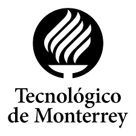

[EN](/en/) · [ES](/es/) · [FR](/fr/) · [EU](/eu/) · [RU](/ru/) · [HI](/hi/) · [AR](/ar/) · [中文](/zh/)

  

  

    <h1>EHUTEC</h1>
    <h2>TMPlus Suite: передовое диагностическое ПО для токарной обработки и фрезерования</h2>
  

  

 

Совместная инициатива Университета Страны Басков (EHU) и Tecnológico de Monterrey (TEC), направленная на развитие международного сотрудничества в области передового производства и цифровых технологий обработки

## Быстрые ссылки

### Turn+
- Репозиторий: https://github.com/Gourpe23/TurnPlus
- Скачать (последний релиз): https://github.com/Gourpe23/TurnPlus/releases/latest

### Mill+
- Репозиторий: https://github.com/Gourpe23/MillPlus
- Скачать (последний релиз): https://github.com/Gourpe23/MillPlus/releases/latest
